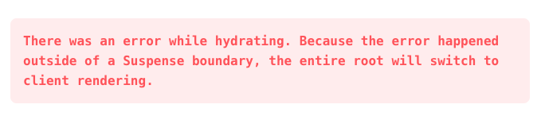
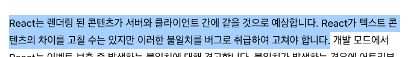

회사 프로젝트를 진행하면서 Nextjs 프레임워크를 사용했었는데, React Hydration과 관련하여 [문제](https://reactjs.org/docs/error-decoder.html/?invariant=423)가 발생한적이 있습니다.

프로그래밍 작업을 하면서 공식문서에서 버그라고 명시된 방식데로 구현을 해버렸고, 개발모드에서 오류 경고가 뜨지않아 발생했던 문제였습니다.

오늘은 React의 Hydration개념과 Streaming SSR에 대해서 알아보고, Hydration사용 시 주의해야할 점에 대해서도 이야기 해보도록 하겠습니다.

# Hydration(수분보충)

# Streaming SSR(React18)

# 주의해야할 점

# References

- https://reactjs.org/docs/error-decoder.html/?invariant=423
- https://ko.reactjs.org/docs/react-dom.html#hydrate
- https://velog.io/@huurray/React-Hydration-%EC%97%90-%EB%8C%80%ED%95%98%EC%97%AC
