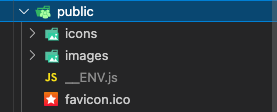

Nextjs에서는 환경변수를 제공을 위해 dotenv 형태의 파일을 작성하면 내부적으로 알아서 설정을 해주도록 되어있는데요. 문제는 해당 방식은 '빌드'타임에 환경변수를 만들어서 주입해주는 방식이기 떄문에, 환경이 여러개면 각 환경별로 빌드를 해야하고 각각의 빌드 결과물은 해당 환경에만 종속되게 됩니다.(별로 좋은 방법이 아니죠.) 저도 Nextjs로 만들어진 프로젝트를 진행할때 해당 문제때문에 CI/CD 작성이 매우 지저분해졌던 경험이 있는데요. 본 글에서는 이러한 문제를 어떻게 해결했는지 한번 이야기 해보도록 하겠습니다.

## Nextjs 환경변수

먼저 [Nextjs에서 환경변수를 주입하는 방법](https://nextjs.org/docs/basic-features/environment-variables)을 살펴보면 다음과 같은 순서대로 진행됩니다.

##### 1. dotenv(``env.local``, ``env.development``, ``env.production``) 파일 생성

```dotenv
REDIRECT_HOST=https://flowergeji.me
PORT=3000
NEXT_PUBLIC_API_HOST=https://flowergeoji.api
```

##### 2. 코드에서 환경변수 사용

```ts
// server.ts
function redirectHost() {
    return process.env.REDIRECT_HOST
}

// client.ts
functon fetchUser() {
    fetch(`${process.env.NEXT_PUBLIC_REDIRECT_HOST}/user`)
}
```

##### 3. 빌드시에 웹팩이 환경변수 사용 코드를 dotenv에 작성된 값으로 치환합니다.

```ts
function redirectHost() {
    return "https://flowergeji.me"
}

// client.ts
functon fetchUser() {
    fetch(`${"https://flowergeoji.api"}/user`)
}
```

dotenv 파일 작성으로 환경변수들을 한곳에서 관리할수 있는 장점이 있지만, '빌드'시에 주입을 하기때문에 여러 환경에 배포를 하려면 각 환경마다 빌드를 만들어줘야하는 불편함이 있습니다. 환경별로 빌드를 진행하게되면 각 빌드 타이밍마다 다른 사이드 이펙트들이 발생할 여지가 있고, 이는 빌드 결과물의 신뢰성을 낮추게됩니다.

### Nextjs Runtime Configuration

Nextjs에서는 Runtime Configuration을 통해 런타임때 환경변수처럼 설정값들을 제공할 수도 있습니다.

##### 1. next.config.js에서 ``publicRuntimeConfig``, ``serverRuntimeConfig`` 작성

```js
module.exports = {
    serverRuntimeConfig: {
        // Will only be available on the server side
        redirectHost: "https://flowergeji.me",
        port: 3000,
    },
    publicRuntimeConfig: {
        // Will be available on both server and client
        apiHost: "https://flowergeoji.api"
    },
}
```

##### 2. ``next/config``를 사용하여 설정값 가져오기

```ts
import getConfig from "next/config"

const { serverRuntimeConfig, publicRuntimeConfig } = getConfig()

function redirectHost() {
    return serverRuntimeConfig.redirectHost
}

// client.ts
function fetchUser() {
    fetch(`${publicRuntimeConfig.apiHost}/user`)
}
```

하지만 공식 문서를 보면 그렇게 추천하지는 않는것 같고, 환경별로 환경변수들을 작성하기에는 부족한 부분이 있어 보입니다.

> Generally you'll want to use build-time environment variables to provide your configuration. The reason for this is that runtime configuration adds rendering / initialization overhead and is incompatible with Automatic Static Optimization.

> 일반적으로 빌드타임 환경변수를 사용하게 될겁니다. Runtime Configuration은 렌더링과 초기화에 오버헤드를 추가하게되고, Automatic Static Optimization과 호환되지 않습니다.

- 환경별로 분기되는 기능을 제공하지 않기 때문에 ``next.config.js``에 모든 환경변수를 다 넣어주거나, 런타임시 ``serverRuntimeConfig``, ``publicRuntimeConfig`` 값을 환경별로 바꿀수 있도록 별도의 작업이 필요합니다.
- [Automatic Static Optimization](https://nextjs.org/docs/advanced-features/automatic-static-optimization)과 호환되지 않기때문에 SSG(Static Site Generator, nextjs 기본방식)방식으로 페이지 렌더링을 하면 Runtime Configuration을 사용할 수 없습니다.(환경변수를 사용하는 페이지는 SSR(Server-Side Rendering)방식을 사용해야합니다.)

---

## 환경변수 URL 방식

> SSG를 꼭 사용해야하는데...Runtime Configuration 만으로는 부족해 보이는데...

이러한 여러가지 제한때문에 Nextjs에서 런타임 환경변수를 사용하려면 다른 방법을 사용해야합니다. 그중에 하나가 [환경변수 URL](https://dev.to/matt_catalfamo/runtime-configurations-with-react-22dl)입니다. 환경변수를 글로벌 변수에 넣어주는 public script파일을 만들고, 환경변수를 사용하는 클라이언트에서 해당 public 파일을 가져가서 사용하는 방식입니다.

##### 1. 런타임에 실행할 js파일을 생성
    
```{nextjs-project-directory}/cli.js```

##### 2. 환경별로 dotenv 파일을 파싱하는 코드 작성

```js
const Dotenv = require("dotenv")

async function parseDotenv(appEnv) {
    const envFilePath = `${fs.realpathSync(process.cwd())}/.env.${appEnv ?? "dev"}`

    const parsedEnv = Dotenv.config({ path: envFilePath }).parsed || {}

    return parsedEnv
}
```

##### 3. 파싱된 환경변수를 클라이언트에서 사용할 수 있도록, ``window`` 객체에 저장하는 javascript파일을 생성

```js
const fs = require("fs")

function writeENV(parsedEnv) {
    const destFilePath = `${fs.realpathSync(process.cwd())}/public/__ENV.js`

    fs.writeFileSync(destFilePath, `window.__ENV = ${JSON.stringify(parsedEnv)}`)
    
    return parsedEnv
}
```

##### 4. 서버에서도 환경변수를 사용할 수 있도록, 대상 dotenv파일을 ``.env`` 파일에 복사

```js
const fs = require("fs")

function copyENV(appEnv) {
    const envFilePath = await findUp(`.env.${appEnv}`)

    const dotenvFilePath = `${fs.realpathSync(process.cwd())}/.env`

    fs.copyFileSync(envFilePath, dotenvFilePath)
}
```

##### 5. cli library(yargs와 같은)를 사용하여 스크립트에서 실행할 수 있도록 작성
```js
const yargs = require("yargs/yargs")
const { hideBin } = require("yargs/helpers")

yargs(hideBin(process.argv))
    .command(
        "gen-env",
        "Create nextjs runtime environment js",
        function builder(y) {
            return y
                .option("env", {
                    alias: "e",
                    type: "string",
                    description: "Environment name(ex: dev, staging, real)",
                })
        },
        async function handler(args) {
            const appEnv = args.e || args.env || "dev"

            const parsedEnv = await parseDotenv(appEnv)

            writeENV(parsedEnv)

            return parsedEnv
        }
    )
    .parse()
```

##### 5. nextjs를 실행할때, 작성한 cli 같이 실행
```json
// package.json

{
    //...

    "scripts": {
        //...

        "dev": "node ./cli.js gen-env --e ${APP_ENV} && next dev",
        "start": "node ./cli.js gen-env -e ${APP_ENV} && next start",

        //...
    },

    //...
}
```

```
APP_ENV=dev yarn dev
```

```
APP_ENV=dev yarn start
```

##### 6. 환경변수 URL사용하기

위와 같은 cli를 작성하여 실행하면 public 폴더에 환경변수를 주입해주는 파일이 생성되고 .env파일이 복사된것을 볼 수 있습니다.




이렇게 만들어진 public 환경변수 스크립트 파일을 클라이언트에서 가져가서 사용하도록 해줍니다.

```jsx
class MyDocument extends Document {
    render() {
        return (
            <Html>
                <Head>
                    <script src="/__ENV.js" />
                </Head>
                <body>
                    <Main />
                    <NextScript />
                </body>
            </Html>
        )
    }
}
```

그러면 클라이언트에서는 ``window`` 객체를 통해 환경변수를 사용할 수 있게되고, 서버에서는 nexjts가 실행될때 ``.env`` 파일을 파싱하게되어 ``process.env`` 객체를 통해 환경변수를 사용할 수 있게됩니다.

```ts
export default function env(envName: string): string {
    if (isClientBrowser()) {
        return window.__ENV[envName]
    } else {
        return process.env[envName]
    }
}
```