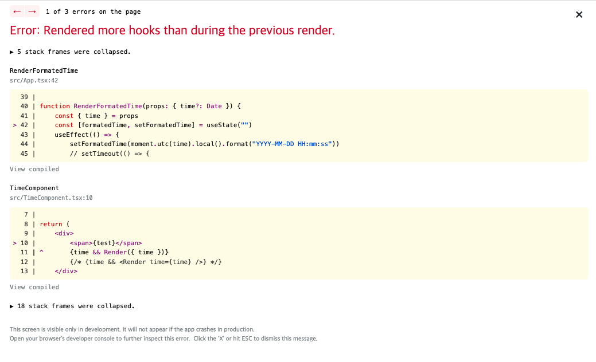

# React Error 300 & 310

React 애플리케이션을 만들다 보면 종종 다음과 같은 오류들을 만날 수가 있습니다.



> [React error 300](https://reactjs.org/docs/error-decoder.html/?invariant=300) - Rendered fewer hooks than expected. This may be caused by an accidental early return statement.

> [React error 310](https://reactjs.org/docs/error-decoder.html/?invariant=310) - Rendered more hooks than during the previous render.

해당 오류들은 간단하게 말하면, **React Hook이 [사용 규칙](https://reactjs.org/docs/hooks-rules.html)에 맞게 실행되지 않아서 발생하는 오류라고 볼 수 있습니다.** 컴포넌트에서 사용중인 Hook이 다 실행되기 전에 렌더링이 끝나버린다던지(React erro 300), 직전의 렌더링에서 Hook이 실행됬지만 이후의 렌더링에서 실행이 되지 않는 경우(React error 310)라고 볼 수 있습니다. 이번 글에서는 Hook을 사용할때 지켜야하는 규칙이 뭔지 그리고, 어떻게 주의하며 사용해야하는지 알아보도록 하겠습니다.

# Hook 사용 규칙

React 컴포넌트는 Hook의 호출 순서로 자신의 상태를 관리하기 때문에, 컴포넌트 내부의 모든 Hook들은 매번 렌더링 때마다 항상 같이 실행되어야 합니다.(Hook이 뒤죽박죽으로 실행되면 상태 관리가 되지 않습니다.)

그렇기 때문에 Hook을 사용할 때는 [Hook 규칙](https://reactjs.org/docs/hooks-rules.html)을 지켜서 사용해야 합니다.

- **Only Call Hooks at the Top Level** - Hook은 컴포넌트의 Top level(가장 위)에서 선언되어야 한다.
- **Don’t call Hooks inside loops, conditions, or nested functions** - Hook은 반복문이나 조건문 또는 콜백 함수 내부에서 선언돼서는 안된다.
- **Only Call Hooks from React Functions** - Hook은 오직 React Function Component에서만 사용해야한다.
- **Don’t call Hooks from regular JavaScript functions** - Hook으 React Function Component가 아닌 다른 함수에서 사용하면 안된다.

# Hook을 잘못 사용하면 어떻게 될까?

## Hook을 top level에서 사용하지 않을 경우

Hook을 Top level(컴포넌트 코드 최상단)에서 사용하지 않을 경우 Hook이 제대로 실행되지 않을 수 있고, React 컴포넌트는 렌더링을 위한 다음 상태를 파악할 수 없게 됩니다.

```tsx{14}
function App() {
    const [time, setTime] = useState<Date>(new Date())

    // ⛔️ Error300 - Rendered fewer hooks than expected. 
    // This may be caused by an accidental early return statement.
    if (time !== undefined) {
        return (
            <div className="App">
                <span>{time.toString()}<span/>
            </div>
        )
    }

    const [another, setAnother] = useState<string>("")

    return (
        <div className="App">
            <button onClick={()=>setTime(undefined)}>Remove time</button>
        </div>
    )
}
```

```tsx
// -----------------------
// First rendering
// 1. time state 초기화
✅ const [time, setTime] = useState<Date>(new Date())
// 2. another state 초기화
✅ const [another, setAnother] = useState<string>("")

// -----------------------
// Click Button
setTime(undefined)

// -----------------------
// Second rendering
// 1. 초기화가 끝났으므로, 입력값 무시
✅ const [time, setTime] = useState<Date>(new Date())
// 2. 렌더링 리턴
// 3. another state를 읽지 못하여 다음 상태를 알 수 없음.
⛔️ // const [another, setAnother] = useState<Date>(new Date())
```

Hook을 Top level에서 사용하여, 항상 실행될 수 있도록 해야 합니다.

```tsx{3}
function App() {
    const [time, setTime] = useState<Date>(undefined)
    const [another, setAnother] = useState<string>("")

    // ✅  Error300 - Rendered fewer hooks than expected. This may be caused by an accidental early return statement.
    if (time !== undefined) {
        return (
            <div className="App">
                <span>{time.toString()}<span/>
            </div>
        )
    }

    return (
        <div className="App">
            <button onClick={()=>setTime(new Date())}>Stop time</button>
        </div>
    )
}
```

## 조건부(if)로 렌더링 또는 Hook을 실행하는 경우

Hook은 조건부(if)로 실행돼서는 안됩니다. 조건부로 Hook이 실행되면 렌더링 사이클마다 실행되는 Hook이 달라지기 때문에 문제가 발생할 수 있습니다.

```tsx{4-9}
function App() {
    const [time, setTime] = useState<Date>(undefined)

    // ⛔️ Error310 - Rendered more hooks than during the previous render.
    if (time !== undefined) {
        useEffect(()=>{
            alert(time)
        }, [time])
    }

    return (
        <div className="App">
            <span>{time.toString()}<span/>
            <button onClick={()=>setTime(new Date())}>Stop time</button>
        </div>
    )
}
```

```tsx
// -----------------------
// First rendering
// 1. time state 초기화
✅ const [time, setTime] = useState<Date>(undefined)

// -----------------------
// Click Button
setTime(new Date())

// -----------------------
// Second rendering
// 1. 초기화가 끝났으므로, 입력값 무시
✅ const [time, setTime] = useState<Date>(undefined)
// 2. dependency를 파악하여 effect 함수를 실행해야 하지만, 이전에 없었기 때문에 파악할 수 없음.
⛔️ useEffect(()=>{alert(time)}, [time])
```

Hook은 항상 렌더링 사이클에 맞춰서 실행되어야 하며, 각 렌더링마다 동일한 Hook들이 사용돼야 합니다. **필요한 조건부나 반복문 또는 콜백 함수 로직들은 Hook 안에서 처리할 수 있도록 해야 합니다.**

```tsx{4-9}
function App() {
    const [time, setTime] = useState<Date>(undefined)

    // ✅ 
    useEffect(()=>{
        if (time !== undefined) {
            alert(time)
        }
    }, [time])
    

    return (
        <div className="App">
            <span>{time.toString()}<span/>
            <button onClick={()=>setTime(new Date())}>Stop time</button>
        </div>
    )
}
```

## Render Props를 조심하자

[Render Props](https://reactjs.org/docs/render-props.html) 방식에서도 Hook 사용은 조심해야 합니다. Render Props는 컴포넌트에 React element를 반환하는 함수를 프로퍼티로 전달(children이 아닌) 하여 좀 더 자유로운 렌더링 로직을 구현할 수 있게 하지만, 한 가지 주의해야 할 것이 있습니다.

React Node 형태(children)로 렌더링을 호출하지 않고, Render Props 방식처럼 함수 호출로 렌더링을 하게 되면 **Component가 아니기 때문에 별도의 라이플 사이클을 가지지 않게 됩니다. 즉, Render Props 방식의 함수 호출은 일반적인 함수 호출과 동일하다는 의미가 되고, 해당 함수에서는 Hook을 사용하면 안 된다는 의미가 됩니다.(Only Call Hooks from React Functions, Don’t call Hooks from regular JavaScript functions)**

만약 Render Props 함수에서 Hook을 사용하게 되면, 해당 함수는 컴포넌트가 아니기 때문에 사용된 Hook은 함수를 호출한 컴포넌트에서 실행되게 되어 문제가 발생하게 됩니다.

```tsx
function TimeComponent(props: { 
    time?: Date; 
    render: (date?: any) => JSX.Element 
}) {
    const { time, render } = props
    const [label] = useState("시간은 ")

    return (
        <div>
            <span>{label}</span>
            {time && render({ time })}
        </div>
    )
}

function App() {
    const [time, setTime] = useState<Date>(undefined)

    const onClickButton = function () {
        setTime(new Date())
    }

    return (
        <div className="App">
            <TimeComponent time={time} render={renderFormatedTime} />
            <button onClick={onClickButton}>Stop time</button>
        </div>
    )
}
function renderFormatedTime(props: { time?: Date }) {
    const { time } = props
    const [formatedTime, setFormatedTime] = useState("")

    useEffect(() => {
        setFormatedTime(moment.utc(time).local().format("YYYY-MM-DD HH:mm:ss"))
    }, [time])

    return <span>{formatedTime}</span>
}
```

```tsx
// -----------------------
// First rendering - <TimeComponent>
// 1. props 전달(time=undefined, render=function)
✅ const { time, render } = props
// 2. label state 초기화
✅ const [label] = useState("시간은 ")

// -----------------------
// Click Button - <App>
setTime(new Date())

// -----------------------
// Second rendering - <TimeComponent>
// 1. props 전달(time=date, render=function)
✅ const { time, render } = props
// 2. 초기화가 끝났으므로, 입력값 무시
✅ const [label] = useState("시간은 ")
// 3. render 함수 호출로 인해 useEffect가 실행됨, 기존에 없었기때문에 상태 파악 불가
⛔️ useEffect(() => {
    setFormatedTime(moment.utc(time).local().format("YYYY-MM-DD HH:mm:ss"))
}, [time])    .
```