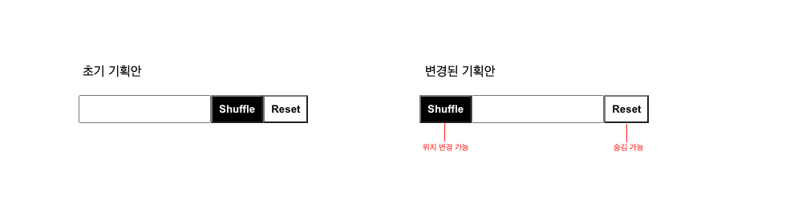
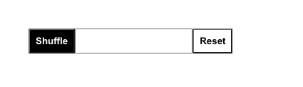

디자인 시스템을 개발할 때 컴포넌트의 프로퍼티를 좀 더 깔끔하게 만들 수는 없을까 고민하면서 이런저런 글을 보다가 Compound Componets라는 패턴을 알게 되었고 이를 실무에 적용하면서 컴포넌트들을 좀 더 깔끔하게 만들었던 적이 있습니다. 이런 경험을 토대로 이번 포스팅에서는 Compound Components 패턴이 무엇인지 그리고 어떠한 특징들이 있는지를 이야기해 보겠습니다.

# Compound Components Pattern

Compound Components는 간단하게 말하면 **서로 내부 상태를 공유하는 컴포넌트 집합이라고 보면 되겠습니다.** 간단한 예시로 기본 html 태그인 `<select>`와 `<option>` 또는, Material-ui의 [`<RadioGroup/>`](https://mui.com/material-ui/react-radio-button/#radio-group) 같은 컴포넌트들을 들 수 있습니다.

```tsx
const CompoundComponents: React.FC<ICompoundComponentsProps> = function () {
    const [_value, _setValue] = useState("value2")

    return (
        <select value={_value} onChange={event => _setValue(event.target.value)}>
            <option value="value1">Label1</option>
            <option value="value2">Label2</option>
            <option value="value3">Label3</option>
        </select>
    )
}
```

`<select>`와 `<option>`태그를 살펴보면, `<option>`이 selected가 상태가 되면 `<select>`의 onChange 이벤트가 트리거 되고, `<select>`의 value 프로퍼티로 `<option>`의 selected 상태가 컨트롤되는 모습을 볼 수 있습니다.

이처럼 <u>서로 상태를 공유하면서 내부적으로 서로 결합되어 있는 컴포넌트</u>들을 Compounnd Components라고 하며, Compound Components 패턴을 사용하면 컴포넌트들 간에 공통 관심사를 손쉽게 연결할 수 있으며 컴포넌트의 복잡도 측면에서도 여러 가지 장점을 가지고 있습니다.

-   **컴포넌트의 복잡도를 낮추어 깔끔하게 작성할 수 있습니다.**
-   **적은 결합도(Coupling)를 유지하면서 공통 관심사를 깔끔하게 공유할 수 있습니다.**
-   **컴포넌트들이 서로 복잡하게 엮이지 않고, 각 역할마다 명확하게 컴포넌트를 분리할 수 있어 재사용성이 높고 유지 보수가 수월합니다.**

# 어떤 차이가 있을까?

한번 예제를 통해서 Compound Components를 사용했을 때와 사용하지 않았을 때 어떻게 다른지 알아보겠습니다.

아래 예시 컴포넌트는 `Input`과 `Shuffle 버튼`, `Reset 버튼`으로 구성되어 있으며, `Shuffle 버튼`을 누르면 난수를 생성하고 `Reset 버튼`으로 값이 초기화되는 기능이 구현되어 있습니다. 초기 요구사항에서는 `Input-Shuffle 버튼-Reset 버튼` 순서로 되어 있었지만, 추후에 기능은 동일하지만 디자인은 조금 다른 요구사항이 추가되었다고 가정해 보겠습니다.



{/* <!--  --> */}

```tsx{13-14}
// 초기 형태
<NonCompoundShuffle
    min={10}
    max={100}
    onShuffle={(value) => _setValue(value)}
    onReset={() => _setValue(0)}
/>

// 변겨사항 적용 후
<NonCompoundShuffle
    min={10}
    max={100}
    useReset={true}             // <== 추가
    shuffleBtnPosition={"left"} // <== 추가
    onShuffle={(value) => _setValue(value)}
    onReset={() => _setValue(0)}
/>
```

해당 컴포넌트를 단일 컴포넌트로 작성했을 경우 추가된 요구사항을 반영하기 위해서 Property를 추가하고 내부 상태와 로직을 수정해야 합니다. **이러한 상황들은 컴포넌트를 더 복잡하게 만들고 수정 이후 컴포넌트의 API 변경으로 사이드 이펙트들을 신경 써야 하는 부담감을 주게 되며, 컴포넌트는 점점 더 요구사항에 유연하게 대처할 수 없게 됩니다.**

```tsx{8-10,20-22}
// 초기 형태
<CompoundShuffle
    min={10}
    max={100}
    onShuffle={(value) => _setValue(value)}
    onReset={() => _setValue(0)}
>
    <Input />
    <Button type={"submit"} />
    <Button type={"reset"} />
</CompoundShuffle>

// 변경사항 적용 후
<CompoundShuffle
    min={10}
    max={100}
    onShuffle={(value) => _setValue(value)}
    onReset={() => _setValue(0)}
>
    <Button type={"submit"} />
    <Input />
    <Button type={"reset"} hidden={true}/>
</CompoundShuffle>
```

그럼 Compound Components 패턴은 어떨까요? 위 예제 코드에서는 `<CompoundShuffle>` 컴포넌트가 children으로 `<Input>`과 `<Button>` 컴포넌트가 들어오면 내부 상태와 로직을 공유하여 요구사항의 기능대로 동작하도록 하고 있습니다.

`<CompoundShuffle>` 컴포넌트가 요구사항의 '기능'역할만을 담당하고, '디자인'역할은 각각의 컴포넌트들과 ReactNode 구성으로 나타내고 있습니다. **이렇게 명확하게 역할들이 구분되면서 요구사항이 수정되거나 추가되더라도 좀 더 유연하게 처리하는 모습을 볼 수 있습니다.** 또한 각각의 컴포넌트들은 각자의 역할대로 독립적으로 재사용할 수 있으며 필요에 따라 Compound Components로 결합되어 사용될 수도 있습니다.

# Context Provider

이런 Compound Components 패턴은 내부를 살펴보면 [React Context](https://ko.reactjs.org/docs/context.html)를 사용하여 상태와 로직을 공유하는 것을 볼 수 있습니다.

```tsx{10-13, 35-47}
interface ICompoundShuffleProps {
    min: number
    max: number
    onShuffle?: (value: number) => void
    onReset?: () => void
    children?: React.ReactNode
}

// #1 Context 생성
const ShuffleContext = createContext<(ICompoundShuffleProps & { value?: number }) | undefined>({
    min: 0,
    max: 9999,
})

// #2 Context.Provider 컴포넌트 만들기
const CompoundShuffle: React.FC<ICompoundShuffleProps> = function ({
    min,
    max,
    onShuffle,
    onReset,
    children,
}) {
    const [_value, _setValue] = useState(0)

    const _onShuffle = function (value: number) {
        _setValue(value)
        onShuffle?.(value)
    }

    const _onReset = function () {
        _setValue(0)
        onReset?.()
    }

    return (
        <ShuffleContext.Provider
            value={{
                min,
                max,
                value: _value,
                onShuffle: _onShuffle,
                onReset: _onReset,
            }}
        >
            <label className="Shuffle">{children}</label>
        </ShuffleContext.Provider>
    )
}
```

공유할 상태 값이나 콜백 함수들을 가지는 Context-Provider 패턴의 컴포넌트를 만들고, children들이 해당 Context를 사용할 수 있도록 합니다.

```tsx
export const Input: React.FC<IInputProps> = function ({ value, ...others }) {
    const shuffleContext = useContext(ShuffleContext)
    const isCompounded = shuffleContext !== undefined

    return <input value={isCompounded ? shuffleContext?.value : value} {...others} />
}
```

```tsx
export const Button: React.FC<IButtonProps> = function ({ type, onClick, hidden, children, ...others }) {
    const shuffleContext = useContext(ShuffleContext)
    const isCompounded = shuffleContext !== undefined
    const isSubmit = type === "submit"
    const isReset = type === "reset"

    /* ----- 생략 ----- */

    const _onClick: MouseEventHandler<HTMLButtonElement> = function (event) {
        if (isCompounded) {
            if (isSubmit) {
                shuffleContext.onShuffle?.(calRandomNumber(shuffleContext.min, shuffleContext.max))
            }
            if (isReset) {
                shuffleContext.onReset?.()
            }
        } else {
            onClick?.(event)
        }
    }

    /* ----- 생략 ----- */
}
```

그리고 같이 상태를 공유할 컴포넌트들은 `useContext`를 통하여 해당 Context를 가져와 사용하게 됩니다. 만약 Context가 존재한다면 결합된 형태(`Compound Components`)로 동작하고, 존재하지 않으면(`undefined`) 각자 독립된 역할들을 수행하도록 컴포넌트들을 작성합니다.

# 마무리

여느 패턴들이 다 그렇듯 Compound Components 패턴도 많은 장점을 가지고 있지만 적재적소에 사용되지 않으면 오히려 컴포넌트를 더 복잡하게 만들 수도 있습니다. 그러므로 여러 가지 React 패턴들에 대한 이해도를 높이고 익숙해지도록 노력하여 우리 모두 깔끔하고 이쁜 컴포넌트들을 만들 수 있으면 좋겠습니다.
