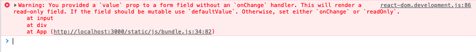

React 작업을 하다 보면 간혹 다음과 같은 경고나 오류 문구를 볼 수 있는데, 이는 제어 컴포넌트(Controlled Component)를 잘못 사용했을 때 뜨는 경고나 오류입니다. 오늘 포스팅에서는 제어 컴포넌트가 무엇인지 그리고 제어 컴포넌트를 만드는 방법에 대해 이야기해 보겠습니다.




# Control Props Pattern

Control Props Pattern은 props를 통해 외부에서 컴포넌트의 상태를 제어(Controlled Component) 할 수 있도록 만드는 방법입니다. 

```tsx
// 비제어 컴포넌트(Un-controlled Component)
const UncontrolledCounter: React.FC = function () {
    const [_valueState, _setValueState] = useState(0)

    const _onClickUp = function () {
        _setValueState((prev) => (prev ? prev + 1 : 1))
    }

    const _onClickDown = function () {
        _setValueState((prev) => (prev ? prev - 1 : -1))
    }

    return (
        <div>
            <span>{_valueState}</span>
            <button onClick={_onClickUp}>up</button>
            <button onClick={_onClickDown}>down</button>
        </div>
    )
}
```

```tsx
// 제어 컴포넌트(Controlled Component)
interface IControlledComponentProps {
    value?: number
    onChange?: (next: number) => void
}

const ControlledCounter: React.FC<IControlledComponentProps> = function ({ value: valueProp, onChange }) {
    const [_valueState, _setValueState] = useState(value ?? 0)

    const _onClickUp = function () {
        // value prop이 없으면, value state로 상태를 컨트롤.
        if (valueProp === undefined) {
            const nextValue = _valueState + 1
            _setValueState(nextValue)
            onChange?.(nextValue)
        }
        // value prop이 있으면, value prop으로 상태를 컨트롤.
        else {
            onChange?.(valueProp + 1)
        }
    }

    const _onClickDown = function () {
        // value prop이 없으면, value state로 상태를 컨트롤.
        if (valueProp === undefined) {
            const nextValue = _valueState - 1
            _setValueState(nextValue)
            onChange?.(nextValue)
        }
        // value prop이 있으면, value prop으로 상태를 컨트롤.
        else {
            onChange?.(valueProp - 1)
        }
    }

    return (
        <div>
            <span>{valueProp ?? _valueState}</span>
            <button onClick={_onClickUp}>up</button>
            <button onClick={_onClickDown}>down</button>
        </div>
    )
}
```

위 예제에서 볼 수 있듯이, 비제어 컴포넌트는 컴포넌트 내부 상태만 사용하기 때문에 컴포넌트 외부에서는 어떠한 간섭도 할 수 없습니다. 하지만 제어 컴포넌트로 구현하면 컴포넌트 외부에서도 컴포넌트의 상태를 관리할 수 있게 됩니다.

**이는 만들어진 컴포넌트를 사용하는 사용자한테 좀 더 유연성과 제어권을 줄 수 있고(IOC, Inversion Of Control), 상태를 한곳에서 관리하는 SSOT(Single Source Of Truth)가 가능해집니다.**


# Hook을 사용하여 간단하게 만들기

Control Props Pattern은 컴포넌트의 구현이 복잡해질 수 있으므로 Hook을 사용하여 좀 더 간결하게 만들어보도록 하겠습니다.

```tsx
interface IUseControlledArgs<T = any> {
    valueProp?: T
    defaultValue?: T
}

type IUseControlledReturn<T=any> = [T | undefined, React.Dispatch<React.SetStateAction<T | undefined>>]

function useControlled<T = any>({ valueProp, defaultValue }: IUseControlledArgs<T> = {}): IUseControlledReturn<T> {
    // 초기 설정
    // valueProp은 외부에서 제어하는 상태 값, _state는 내부에서 사용하는 상태 값
    // valueProp이 존재하면 제어 상태(isControlled=true)
    // _state의 초깃값은 defaultValue
    const { current: isControlled } = useRef(valueProp !== undefined)
    const [_state, _setState] = useState<T | undefined>(defaultValue)

    // 비제어 상태이면 _state(내부)를 사용, 제어 상태이면 valueProp(외부)을 사용
    const value = isControlled ? valueProp : _state

    // 비제어 상태이면 _setState로 내부 상태 변경,
    // 제어 상태이면 외부에서 상태 값을 넣어줄 것이므로 아무것도 하지 않음
    const setValue: React.Dispatch<React.SetStateAction<T | undefined>> = useCallback((newState: T | undefined | ((prev: T | undefined) => T | undefined)) => {
        !isControlled && _setState(newState)
    }, [])

    return [value, setValue]
}
```

```tsx
const ControlledCounter: React.FC<IControlledComponentProps> = function ({ value, onChange }) {
    const [_value, _setValue] = useControlled({ valueProp: value, defaultValue: 0 })

    const _onClickUp = function () {
        _setValue((prev) => (prev ? prev + 1 : 1))
        onChange?.(_value ? _value + 1 : 1)
    }

    const _onClickDown = function () {
        _setValue((prev) => (prev ? prev - 1 : -1))
        onChange?.(_value ? _value - 1 : -1)
    }

    return (
        <div>
            <span>{_value}</span>
            <button onClick={_onClickUp}>up</button>
            <button onClick={_onClickDown}>down</button>
        </div>
    )
}
```

외부에서 넣어주는 상태 값(prop)이 존재하면 해당 값을 사용하고, 존재하지 않으면 내부의 state로 컴포넌트의 상태를 관리할 수 있도록 하는 Hook을 만들어 놓으면 아주 간결하게 제어 컴포넌트를 작성할 수 있습니다.