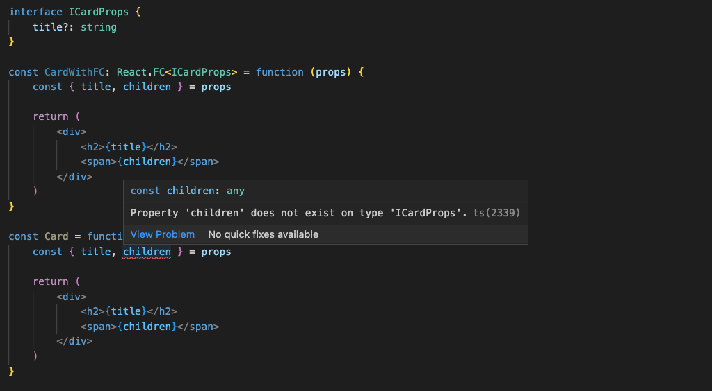
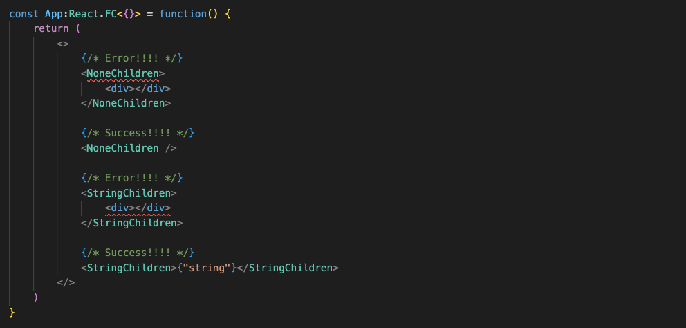

올해(2022년) React 18버전이 출시되면서 몇 가지 변경점과 새로운 기능들이 추가되어는 데요, React 관련 타입 정의에서도 BREAKING CHANGES가 몇 가지 있었습니다. 이번 포스팅에서는 그중에서도 ``React.FC``에서 ``children`` 타입이 제거된 것에 대해서 이야기해 보겠습니다.

# Remove implicitly type children

React 18 타입 정의에서는 [PR](https://github.com/DefinitelyTyped/DefinitelyTyped/issues/46691)에서 이야기한 대로 Functional Component에서 기본 내장 타입에서 children을 제거됐습니다.

<div style="border: solid 1px; margin: 1rem 0;">
    
</div>

위 사진처럼 React 18에서는 ``React.FC``에서 ``children`` 타입이 제거된 것을 볼 수 있으며, ``children``을 사용하려면 직접 타입 정의를 해줘야 합니다.

```tsx
interface IRemovalOfImpliciChildrenProps {
    children?: React.ReactNode
}

const RemovalOfImplicitChildren: React.FC<IRemovalOfImpliciChildrenProps> = function ({ children }) {
    return <div></div>
}

const ChildrenTest = function () {
    return (
        <RemovalOfImplicitChildren>
            <input />
        </RemovalOfImplicitChildren>
    )
}
```

# 왜 없어졌을까?

> "In TypeScript it's generally easier to add types than remove them."

> "타입스크립트에서는 대부분 타입을 제거하는 것보다 추가하는 게 쉽다."

## 일관성

React에서 FC(Funtional Component)는 이름 그대로 '함수'형 컴포넌트이기 때문에, props 변수를 받아서 컴포넌트를 리턴하는 함수를 작성하기만 하면 됩니다.

```tsx
interface ICardProps {
    title?: string
}

// 함수형 컴포넌트
const Card = function ({ text }: ICardProps) {
    return (
        <div>
            <h2>{title}</h2>
        </div>
    )
}
```

그런데 여기서 만약에 React 18버전 이전의 `React.FC` 타입을 선언하게 되면 어떻게 될까요?

<div style="border: solid 1px; margin: 1rem 0;">
    
</div>

위의 예제에서 볼 수 있듯이, `React.FC` 타입에는 `children`이 내장 프로퍼티 타입으로 존재하기 때문에 자동으로 프로퍼티를 사용할 수 있으며 `React.FC` 타입 선언을 하지 않으면 `children` 타입을 사용할 수 없는 것을 볼 수 있습니다. 둘 다 동일하게 함수형 컴포넌트이고 구현체도 동일하지만 `React.FC` 타입을 사용하는 것만으로 차이점이 발생하게 되고 결과물에 일관되지 않게 됩니다.

## 구체적인 children 타입

컴포넌트를 작성하다 보면 좀 더 구체적으로 `children`을 컨트롤해야 할 때도 있습니다. 예를 들면 Input 컴포넌트처럼 `children`을 사용하지 않는다든지, 특정 유형만 사용한다든지 하는 경우들이 있습니다. 하지만 React 18버전 이전의 `React.FC` 타입을 사용하게 되면 `children` 프로퍼티 타입이 내장되어 있기 때문에 컨트롤하기가 어렵습니다.

```tsx
interface ICardProps {
    title?: string
    description?: string
}

const CardWithFC: React.FC<ICardProps> = function (props) {
    const { title, children, description } = props

    if (children) {
        console.error("This component doesn't use chidren")
    }

    return (
        <div>
            <h2>{title}</h2>
            <span>{description}</span>
        </div>
    )
}
```

`children` 을 사용하지 않더라도 명시적으로 표현하기가 힘들고, 좀 더 명확한 타입의 `children`을 명시하고 싶어도 할 수가 없습니다. 그렇기 때문에 React 18버전에서는 내장되어 있던 `children` 프로퍼티 타입을 제거하고 명시적으로 선언하여 사용하도록 하고 있습니다.

```tsx
interface INoneChildrenProps {
    title?: string
    description?: string
}

const NoneChildren: React.FC<INoneChildrenProps> = function (props) {
    const { title, description } = props

    return (
        <div>
            <h2>{title}</h2>
            <span>{description}</span>
        </div>
    )
}

interface IStringChildrenProps {
    title?: string
    children?: string
}

const StringChildren: React.FC<IStringChildrenProps> = function (props) {
    const { title, children } = props

    return (
        <div>
            <h2>{title}</h2>
            <span>{children}</span>
        </div>
    )
}
```

<div style="border: solid 1px; margin: 1rem 0;">
    
</div>