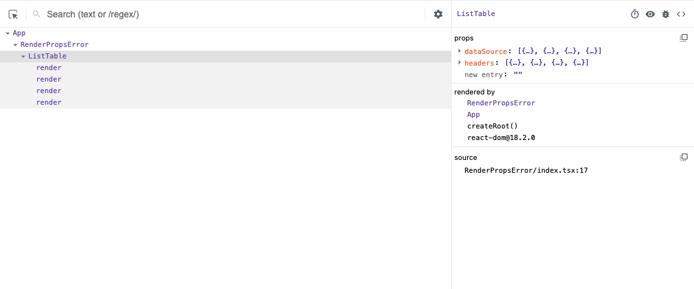
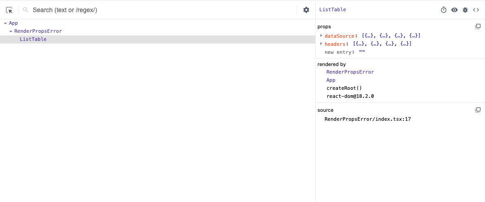
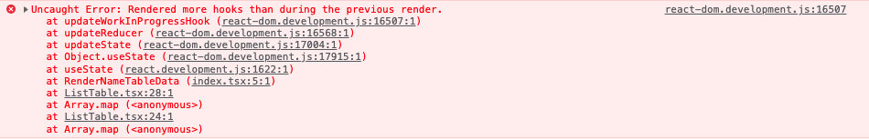

 안녕하세요. 오늘은 프로젝트 진행중에 Render Props를 잘못 사용해서 고생했던 이야기를 해보고자 합니다. 정확하게 Render Props가 무엇인지, 그리고 어떻게 주의해서 사용해야하는지 알아보겠습니다.

# Render Props

> The term "render props" refers to a technique for sharing code between React components using a prop whose value is a function

Render Props 방식은 간단하게 말하자면 React 컴포넌트 ``props``에 ``render function``을 포함시켜 전달하는 방법이며, ``render function``은 React 엘리먼트를 반환하는 함수입니다. 즉, 컴포넌트는 자기자신이 렌더링 로직을 포함하는 대신에 외부로부터 렌더링 로직(``render function``)을 전달받아서 처리할 수 있게됩니다.

코드의 재사용성을 높이고, 컴포넌트간에 Cross-Cutting Concerns(횡단 관심사, 공통 관심사)를 처리할때 주로 사용됩니다.

```tsx{2, 24-27}
export default function ListTable(props: {
    headers: { label: string; index: string | number; render?: (data: any) => JSX.Element }[]
    dataSource: Record<any, any>[]
}) {
    const { headers, dataSource } = props
    const [totalCount, setTotalCount] = useState(0)
    useEffect(() => setTotalCount(dataSource.length), [dataSource])

    return (
        <>
            <label>TotalCount : {totalCount}</label>
            <table>
                <thead>
                    <tr>
                        {headers.map((header) => (
                            <th>{header.label}</th>
                        ))}
                    </tr>
                </thead>
                <tbody>
                    {dataSource.map((data) => (
                        <tr>
                            {headers.map((header) => {
                                // render props - header프로퍼티에 들어있는 render 함수 사용
                                if (header.render) {
                                    return <td>{header.render(data[header.index])}</td>
                                }

                                return <td>{data[header.index]}</td>
                            })}
                        </tr>
                    ))}
                </tbody>
            </table>
        </>
    )
}
```

```tsx{1-3, 7}
function RenderNameTableData(data: any) {
    return <span style={{ fontWeight: 900 }}>{props.data}</span>
}

export default function RenderPropsError() {
    const [headers, setHeaders] = useState([
        { label: "이름", index: "name", render: RenderNameTableData },
        { label: "나이", index: "age" },
        { label: "성별", index: "sex" },
        { label: "직장", index: "job" },
    ])
    const [dataSource, setDataSource] = useState<Record<any, any>[]>([])

    return (
        <div>
            <button
                onClick={() => {
                    setDataSource([
                        { name: "flower", age: 22, sex: "man", job: "Programmer" },
                        { name: "geoji", age: 22, sex: "women", job: "" },
                        { name: "novell", age: 33, sex: "women", job: "Doctor" },
                        { name: "star", age: 30, sex: "man", job: "Teacher" },
                    ])
                }}
            >
                Add DataSource
            </button>
            <ListTable headers={headers} dataSource={dataSource} />
        </div>
    )
}
```

Render Props를 사용함으로써 컴포넌트간에 데이터를 쉽게 공유하고 좀 더 유연하게 렌더링 처리를 할 수 있게됩니다.

# 사용시 주의해야 할 점

> TL;DR
> React 엘리먼트 반환하는 함수(`Component()`)와 컴포너트(`<Component/>`)는 엄연히 다른겁니다!

Render Props를 사용할때 주의해야할 점은 **컴포넌트 렌더링시 함수를 호출하는것과 Component형태로 호출하는것은 엄연히 다른것임을 알아야 한다는것입니다.** React 엘리먼트를 반환하다고 하더라도 '일반적인 함수호출'은 React 컴포넌트로 인식되지 않습니다. 즉, 컴포넌트의 라이프사이클을 가지지 않으며 React node를 구성하지 않는다는 의미입니다. 아래 예시를 통해 좀더 자세히 살펴보도록 하겠습니다.

```tsx{1-3,7}
function RenderNameTableData(props: { data: any }) {
    return <span style={{ fontWeight: 900 }}>{props.data}</span>
}

export default function RenderPropsError() {
    const [headers, setHeaders] = useState([
        { label: "이름", index: "name", render: RenderNameTableData},
        { label: "나이", index: "age" },
        { label: "성별", index: "sex" },
        { label: "직장", index: "job" },
    ])

    /* ------- */
    
}
```

Render Props로 전달되는 render 함수를 마치 함수형 컴포넌트처럼 Props를 전달받는 형태로 바꿔보았습니다. 여기서는 큰 문제가 없습니다. Render Props는 React 엘리먼트를 반환할 수 있으면 되니까요.

그리고 이렇게되면 Render Props를 전달받은 컴포넌트에서는 <u>함수를 직접 호출하거나, 컴포넌트 형태로 호출하는 두가지 방법으로 렌더링이 가능해집니다.</u>

```tsx{9-11}
return (
    {/* ------- */}
    <table>
        {/* ------- */}
        <tbody>
            {dataSource.map((data) => (
                <tr>
                    {headers.map((header) => {
                        if (header.render) {
                            return <td>{header.render({ data: data[header.index] })}</td>
                        }

                        return <td>{data[header.index]}</td>
                    })}
                </tr>
            ))}
        </tbody>
    </table>
)
```

```tsx{9-16}
return (
    {/* ------- */}
    <table>
        {/* ------- */}
        <tbody>
            {dataSource.map((data) => (
                <tr>
                    {headers.map((header) => {
                        if (header.render) {
                            const { render: Render } = header
                            return (
                                <td>
                                    <Render data={data[header.index]} />
                                </td>
                            )
                        }

                        return <td>{data[header.index]}</td>
                    })}
                </tr>
            ))}
        </tbody>
    </table>
)
```

여기까지도 큰 문제는 없습니다. 심지어 코드를 실행하면 렌더링도 정상적으로 가능합니다. 그러면 어떤 차이가 있는걸까요?

## 함수호출과 컴포넌트호출 차이

위 예시처럼 렌더링 한수를 일반적인 함수로 호출하나 컴포넌트 형태로 호출하나 결국 React 엘리먼트를 반환하기 때문에 렌더링 결과에 있어서는 차이가 없어 보일 수 있지만, React Node입장에서는 차이가 있을 수 있습니다.

[React Developer Tools](https://chrome.google.com/webstore/detail/react-developer-tools/fmkadmapgofadopljbjfkapdkoienihi)로 확인해보면 **함수호출 시에는 반환된 엘리먼트가 React Node로 구성되지 않는것을 확인할 수 있습니다.**

<div style="border: solid 1px;">



</div>

*React-Dev tools : Component 호출*


<div style="border: solid 1px;">



</div>

*React-Dev tools : Function 호출*

일반적인 함수호출은 React 엘리먼트만 반환할뿐 자체적으로 라이프사이클과 상태를 가지지 않기때문에 컴포넌트가 될수 없고, React Node를 구성할 수 없습니다.

그렇기때문에 만약 해당 함수에서 Hook을 사용하게 되면 [Hook 사용 규칙](https://reactjs.org/docs/hooks-rules.html#only-call-hooks-from-react-functions)을 어기게되어 문제가 발생하게 됩니다.

```tsx{2}
function RenderNameTableData(props: { data: any }) {
    const [label] = useState("세")

    return <span style={{ fontWeight: 900 }}>{props.data}{label}</span>
}
```


*예상치 못하게 hook이 더 사용되서 발생하는 오류*

이처럼 Render Props를 사용할때는 컴포넌트 내부에서 렌더링 결과물을 반환하다고 하더라도 함수로 호출하는것인지 컴포넌트 형태로 호출하는것인지 잘 파악하고, 그 차이를 인지해서 사용해야 합니다.

# References

- https://reactjs.org/docs/render-props.html
- https://dev.to/igor_bykov/react-calling-functional-components-as-functions-1d3l
- https://kentcdodds.com/blog/dont-call-a-react-function-component