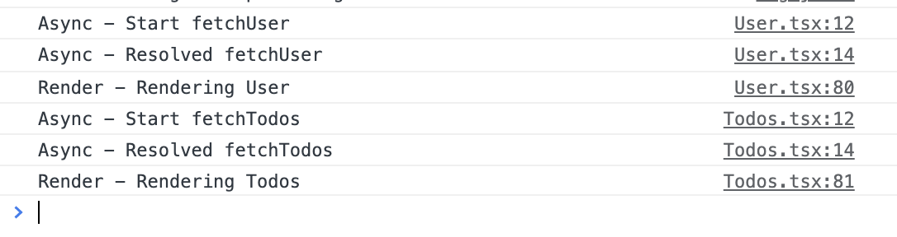
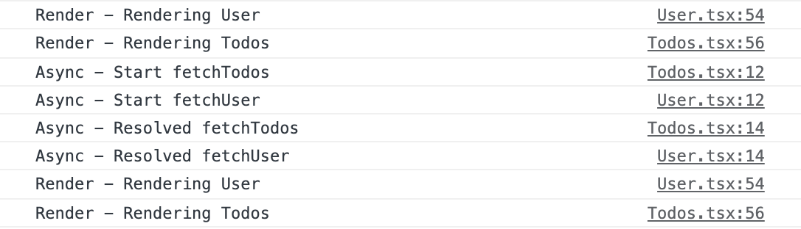

보통 React Suspense라고 하면 React.lazy를 이용해서 비동기적으로 컴포넌트를 가져오고, 이를 통해서 코드 분할을 하여 리액트 어플리케이션의 초기 로딩 속도를 높이는 이야기를 많이 합니다. (React18에서는 SSR까지 지원한다고 합니다.) 본 글에서는 Suspense의 정확한 동작 방식을 알아보고, 비동기 작업을 좀 더 선언적이고 깔끔하게 처리하는 방법에 대해 이야기해 보겠습니다.

> 본 내용은 회사 기술 블로그에서 제가 쓴 포스트를 재구성하여 작성한 글입니다. 회사 기술 블로그를 보고싶으신 분은 [여기](https://fe-developers.kakaoent.com/)로 가시면 됩니다.

## Suspense 동작 방식

먼저 Suspense와 Promise(비동기 작업)의 동작 방식을 살펴보면 다음과 같습니다.

1. Suspense의 children이 **예외 처리로 promise를 던지게 되면(throw)**, Suspense는 fallback 프로퍼티를 렌더링합니다.
2. **예외로 던져진 promise가 완료되면(fulfilled)**, Suspense는 chidren을 다시 렌더링합니다.

```js{21-27}
function usePromise<I, T>(promise: (arg: I) => Promise<T>, arg: I) {
    const [_promise, _setPromise] = useState<Promise<void>>()
    const [_status, _setStatus] = useState<"pending" | "fulfilled" | "error">("pending")
    const [_result, _setResult] = useState<T>()
    const [_error, _setError] = useState<Error>()

    function resolvePromise(result: T) {
        _setStatus("fulfilled")
        _setResult(result)
    }
    function rejectPromise(error: Error) {
        _setStatus("error")
        _setError(error)
    }

    useEffect(() => {
        _setStatus("pending")
        _setPromise(promise(arg).then(resolvePromise, rejectPromise))
    }, [arg])

    if (_status === "pending" && _promise) {
        throw _promise
    }
    if (_error) {
        throw _error
    }
    return _result
}

export default function User({ uid }: { uid: number }) {
    const user = useFetch<number, IUser>(fetchUser, uid)
    console.log("Render - Rendering User")
    return (
        <>
            <h3>{user?.displayName}</h3>
            <p>{user?.description}</p>
        </>
    )
}

export default function App() {
  return (
    <div className="App">
      <Suspense fallback={<h1>Loading...</h1>}>
        <User />
      </Suspense>
    </div>
  );
}
```

<div style="border: solid 1px; margin-bottom: 2rem;">


</div>

---

## 데이터 fetching과 렌더링 그 사이

React에서 일반적으로 렌더링 시 비동기 작업 처리를 어떻게 할까요? [React 문서](https://reactjs.org/docs/concurrent-mode-suspense.html#traditional-approaches-vs-suspense)에서는 컴포넌트 라이프 사이클이나 훅(hook)을 이용하는 방법(2가지)과 Suspense를 이용하는 방법이 있다고 이야기합니다.

- **Fetch-on-render (for example, fetch in useEffect)**: 컴포넌트 렌더링을 먼저 시작하고 ``useEffect``나 ``componentDidMount``로 비동기 처리를 합니다.
- **Fetch-then-render (for example, Relay without Suspense)**: ``useEffect``나 ``componentDidMount``로 화면을 그리는데 필요한 데이터를 모두 조회한 후 렌더링을 시작합니다.
- **Render-as-you-fetch (for example, Relay with Suspense)**: 비동기 작업과 렌더링을 동시에 시작합니다. Suspense는 초기에 ``fallback`` 프로퍼티를 렌더링하고, 비동기 작업이 완료되면 자식 컴포넌트를 다시 렌더링합니다.

**Fetch-on-render** 또는 **Fetch-then-render** 방식으로 비동기 작업을 처리하면 여러가지 어려움들이 있는데요. 어떠한 어려움들이 있는지 살펴보고 **Suspense**를 사용하면 어떻게 달라지는지 이야기해 보도록 하겠습니다.

#### 경쟁 상태(Rece-condition)

경쟁 상태는 둘 이상의 작업들이 진행될 때 각각의 실행 순서나 타이밍 때문에 서로 영향을 받는 상태를 뜻합니다. **Fetch-on-render** 방식에서 비동기 작업들의 경쟁 상태는 논리상으로는 아무런 문제가 없지만, 사용성 측면에서는 많은 문제를 야기할 수 있습니다.


이는 React 컴포넌트들이 각각 자신만의 “생명주기”를 가지고, 마찬가지로 비동기 작업들도 각각 자신만의 “생명주기”를 가지기 때문에 발생하는 문제입니다. 이 문제를 해결하기 위해서 컴포넌트를 만들 때 데이터 fetching과 렌더링 사이를 **동기화하는 작업을 추가하게 됩니다.**

```js{9-14, 32-35}
function User({ uid }: { uid: number }) {
    const [user, setUser] = useState<IUser>()

    // Fetch-on-render
    useEffect(() => {
        fetchUser(uid).then(setUser)
    }, [uid])

    // Synchronizing
    if (L.isEmpty(user)) {
        return <p>Loading...</p>
    }
    // Synchronizing이 없으면
    // Race-condition 문제 발생
    console.log("Render - Rendering User")
    return (
        <>
            <h3>{user?.displayName}</h3>
            <p>{user?.description}</p>
            <Todos puid={uid} />
        </>
    )
}

function Todos({ puid }: { puid: number }) {
    const [todos, setTodos] = useState<ITodo[]>([])

    useEffect(() => {
        fetchTodos(puid).then(setTodos)
    }, [puid])

    // Synchronizing
    if (L.isEmpty(todos)) {
        return <p>Loading...</p>
    }

    console.log("Render - Rendering Todos")
    return (
        <ul>
            {L.map(
                (todo) => (
                    <li key={todo.id}>{`${todo.title} : ${todo.description}`}</li>
                ),
                todos
            )}
        </ul>
    )
}
```


이렇게 위 예제처럼 비동기 작업과 렌더링 사이를 동기화하는 로직을 추가함으로써, 경쟁 상태로 인한 문제점들을 해결할 수 있습니다. 하지만 이러한 작업들은 컴포넌트나 로직의 복잡도를 증가시키고 **Waterfall Problem**을 유발할 수 있습니다.

#### Waterfal Problem(Fetch-on-render)

비동기 작업을 사용하는 가장 큰 이유는 **동시성**을 통하여 **효율성**을 얻는 것인데요. **동기화 처리**를 하다 보면 이 동시성을 포기하고 효율성이 떨어지는 상황에 처하게 됩니다.

<div style="border: solid 1px; margin-bottom: 2rem;">



<span style="display: block; text-align: center; font-weight: bold; color: #666666; font-size: 0.9rem;">[fetchTodos는 fetchUser와 User렌더링 작업이 끝나야만 진행됨]</span>

</div>

동기화 작업 예제의 로그를 살펴보면, <u>각각의 비동기 작업과 렌더링 작업이 동시에 진행되지 않고 순차적으로 진행(**Waterfall**)되면서</u> 비효율적으로 처리되는 모습을 볼 수 있습니다.

그렇다면 비동기 작업들의 동시성을 보장한다면 어떻게 될까요? 비동기 작업들을 한 곳에서 동시적으로 처리하고, 그 결과를 컴포넌트로 전달한다면 비동기 작업들의 동시성을 보장할 수 있습니다. 하지만 이는 컴포넌트들간의 **높은 결합도(High Coupling)를 유발할 수 있습니다.**

#### 높은 결합도(Fetch-then-render)

```js
function User({ uid }) {
  // User Component의 역할이 불명확함(user도 조회하고, todos도 조회)
  // 비동기 작업이 늘어날수록, User의 역할이 너무 커진다(결합도 증가)
  const [user, setUser] = useState({});
  const [todos, setTodos] = useState([]);

  // Fetch-then-render
  useEffect(() => {
    // 비동기 작업 동시적으로 실행
    Promise.all([fetchUser(uid), fetchTodos(uid)]).then(([user, todos]) => {
      setUser(user);
      setTodos(todos);
    });
  }, [uid]);

  // 경쟁 상태 발생하지 않음
  return (
    <>
      <h3>{user?.displayName}</h3>
      <p>{user?.description}</p>
      <Todos todos={todos} />
    </>
  );
}
```

비동기 작업들을 한곳에서 처리하고 그 결과를 각 컴포넌트에게 전달하는 방식은 **컴포넌트들 간의 역할분담이 불명확하게 하고 높은 결합도를 만들 수 있습니다.** 각각의 컴포넌트가 자기 자신의 데이터를 각자 책임질 수 있다면 더 깔끔하지 않을까요?

---

## Suspense와 비동기 작업

이번에는 Suspense를 이용하여 비동기 작업과 렌더링 작업을 처리하면 어떻게 달라지는지 보겠습니다.

```js
function App() {
    const [uid] = useState<number>(1)

    return (
        <div className="App">
            <Suspense fallback={<p>Loading...</p>}>
                <User uid={uid} />
            </Suspense>
        </div>
    )
}

function User({ uid }: { uid: number }) {
    const user = useFetch<number, IUser>(fetchUser, uid)
    console.log("Render - Rendering User")
    return (
        <>
            <h3>{user?.displayName}</h3>
            <p>{user?.description}</p>
            <Suspense fallback={<p>Loading...</p>}>
                <Todos puid={uid} />
            </Suspense>
        </>
    )
}

function Todos({ puid }: { puid: number }) {
    const todos = useFetch<number, ITodo[]>(fetchTodos, puid)
    console.log("Render - Rendering Todos")
    return (
        <ul>
            {L.map(
                (todo) => (
                    <li key={todo.id}>{`${todo.title} : ${todo.description}`}</li>
                ),
                todos
            )}
        </ul>
    )
}
```




이전의 비동기 처리와 비교하면 어떤가요?

- 컴포넌트들이 각자 데이터 fetching을 동시에 시작하게 되어 **waterfall 문제가 발생하지 않습니다.**
- Suspense의 계층구조와 fallback 렌더링으로 컴포넌트들은 **더 이상 경쟁 상태를 신경 쓰지 않아도 됩니다.**
- 컴포넌트들의 역할이 아주 명확하게 분리되고 **결합도가 낮아집니다.**(이제 컴포넌트들은 각자의 데이터를 가져와서 보여주는 것에만 신경 쓰면 됩니다!)
- 동기화 코드가 사라지고 데이터 fetching과 렌더링에만 신경 쓰면 되기 때문에 컴포넌트들의 **복잡도가 낮아졌습니다.**(코드가 깔끔해졌습니다!)

Suspense를 사용함으로써 컴포넌트들을 훨씬 더 선언적이고 깔끔하게 작성할 수 있는 것을 볼 수 있습니다.