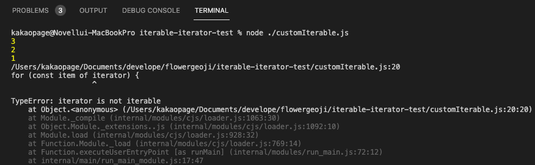

Iterator pattern은 배열과 같은 순차적인 데이터를 순회하기 위한 방법으로, javascript ES6(ECMA2015) 버전부터 Symbol과 함께 추가된 개념입니다. ES6전에는 여러 가지 컬렉션 관련 라이브러리들이 각자의 방법으로 순회 방법들을 제공했었지만, ES6에서는 공식적으로 Iterator/Iterable Protocol을 적용하여 순차적인 데이터의 순회 방식을 통일시켰습니다.

## Iterator & Iterator Protocol

배열이나 맵과 같은 컬렉션 데이터에서 ``for...of``나 ``spread`` 및 ``rest``등의 순차적인 데이터 처리와 ``지연 평가``를 사용하려면 Iterator & Iterable Protocol을 지켜야합니다.

- **Iterator**는 ``{value: any, done: boolean}`` 모양의 객체를 리턴하는 ``next()``라는 함수를 가진 값을 말합니다.

- **Iterable**은 ``[Symbol.iterator]``를 키로 하는 프로퍼티에 **Iterator**를 반환하는 함수가 들어있는 값을 말합니다.

- **Iterator&Iterable protocol**을 준수하면 순차적으로 데이터를 순회할 수 있게 되어 ``for...of``나 ``spread`` 및 ``rest`` 기능들을 사용할 수 있게 됩니다.

Array, Map, Set과 같은 컬렉션형 객체들은 기본적으로 Iterable로써 ``Symbol.iterator``를 키로 하여 Iterator를 반환하는 함수를 가지고 있으며, 반환된 Iterator의 ``next()``함수를 호출하면 컬렉션의 값들이 차례대로 나오는것을 볼 수 있습니다.

```js
// 'Array --------------'
const arrIterable = [1, 2, 3];
for (const item of arrIterable) {
    console.log(item);	// 1  2  3
}

const arrIterator = arrIterable[Symbol.iterator]();

console.log(arrIterator.next());  // { value: 1, done: false }
console.log(arrIterator.next());  // { value: 2, done: false }
console.log(arrIterator.next());  // { value: 3, done: false }
console.log(arrIterator.next());  // { value: undefined, done: true }
```

```js
// 'Map ----------------'
const mapIterable = new Map([[0, 1], [1, 2], [2, 3]])
const mapIterator = mapIterable[Symbol.iterator]();

mapIterator.next();              	// next was already called once, 

for (const item of mapIterator) {	// only rest of items called here
    console.log(item);                // [1,2]  [2,3]
}

console.log(mapIterator.next()); 	// {value: undefined, done: true}
```

이렇게 Iterator & Iterable Protocol을 만족하게 되면, ES6에서 제공하는 ``for...of`` 또는 ``spread``기능을 사용할 수 있습니다.

```js
// 'Iterable functions ----------------'
const arrIterable = [1, 2, 3];

// [for..of] functions
const arrIterator1 = arrIterable[Symbol.iterator]();
for (const item of arrIterator1) {
    console.log(item);  // 1  2  3
}

// [spread | rest] functions
const arrIterator2 = arrIterable[Symbol.iterator]();
const spreadArr = [...arrIterator2, 4, 5];	// 1, 2, 3, 4, 5

const arrIterator3 = arrIterable[Symbol.iterator]();
arrIterator3.next();
const restArr = [...arrIterator3, 4, 5];	// 2, 3, 4, 5

```

기본적으로 제공되는 Iterable외에도 직접 Iterable과 Iterator을 만들어서 사용할 수도 있습니다.

```js
// 'Custom -------------'
const iterable = {
    [Symbol.iterator]() {   // [Symbol.iterator] = () => return iterator
        let i = 0;
        const myItems = ['첫번째', 2, 3.0];

        return {
            next() {
                return i>=3 ? {done: true} : {value: myItems[i++], done: false};
            },
            [Symbol.iterator]() {
                return this;    // well made iterator
            }
        }
    }
}
for(const item of iterable){
  console.log(item);    // 첫번째, 2, 3.0
}
```

---

## Well made Iterator

Well made iterator란 **Iterator이면서 Iterable인 값**을 말하며(보통 자기 자신을 반환하는 Iterator) **Iterator의 재사용성을 높이기 위한 방법입니다.** Well made iterator에 대해 설명하기 앞서 먼저 좀 더 명확하게 Iterable과 Iterator의 관계를 짚어볼 필요가 있습니다.

- Iterator & Iterator Protocol에서 순회는 다음과 같이 진행됩니다.

    1. '**Iterable**'의 ``[Symbol.iterator]`` 프로퍼티에 들어있는 함수를 실행하여 '**Iterator**'를 만듭니다.

    2. 차례대로 '**Iterator**'의 ``next()`` 함수를 호출하여 데이터를 순회합니다.

- 엄밀히 따지면 '**Iterable**'을 순회하는 것이지 '**Iterator**'를 순회하는 것이 아닙니다.

```js{13-16,18-22}
// 'Custom -------------'
const iterable = {
    [Symbol.iterator]() {
        let i = 3;
        return {
            next() {
                return i===0 ? {done: true} : {value: i--, done: false};
            }
        }
    }
}

// iterable 순회
for(const item of iterable){
    console.log(item);  // 3  2  1
}

// iterator 순회(불가능)
const iterator = iterable[Symbol.iterator]();
for(const item of iterator){
    console.log(item);  // Error
}
```



위의 예제처럼 Iterable은 순회가 가능하지만 Iterator를 순회하려고 하면 오류가 발생하게 됩니다. 하지만 이게 뭐가 문제일까요? 사실 프로토콜 상으로는 아무런 문제가 없습니다. Iterable과 Iterator는 제 기능을 다하고 있습니다. **하지만 이러한 구조는 재사용성에 있어서 문제가 발생할 수 있습니다.**

```js{13,21-29}
// 'Custom -------------'
const iterable = {
    [Symbol.iterator]() {
        let i = 3
        return {
            next() {
                return i === 0 ? { done: true } : { value: i--, done: false }
            },
        }
    },
}

// Problem : 첫번째 값은 사용하지 않고, 나머지 값의 합을 출력하고 싶다
// iterable은 단순 순회만 가능하므로, iterator로 처리

function removeFirst(itr) {
    return itr.next()
}

function sumAll(itr) {
    // iterator은 순회가 불가능해서 next를 반복 호출하는 로직을 작성해야한다.
    let item;
    let sum = 0;

    while (true) {
        item = iter.next();
        if(item.done) { break; }
        sum += item.value;
    }
    return sum;
}

const iterator = iterable[Symbol.iterator]()
removeFirst(iterator) // { value: 3, done: false }
sumAll(iterator) // 2+1 = 3
```

위의 코드 예시처럼 단순 순회가 아니라 복잡한 문제를 해결해야하는 경우에는, Iterable의 순회기능을 사용하지 못하고 Iterator만으로 처리해야 합니다. 하지만 위 예시의 Iterator는 순회가 불가능해서 next 호출만으로 문제를 해결하고 있고 이는 코드의 복잡도를 증가시킵니다. 만약 Iterator도 순회가 가능하다면 어떻게 달라질까요?

```js{16,23-28}
// 'Custom -------------'
const iterable = {
  [Symbol.iterator]() {
    let i = 3;
    return {
      next() {
        return i===0 ? {done: true} : {value: i--, done: false};
      },
      [Symbol.iterator]() {
        return this;	// well made iterator
      }
    }
  }
}

// Problem : 첫번째 값은 사용하지 않고, 나머지 값의 합을 출력하고 싶다

function removeFirst(itr) {
    return itr.next()
}

function sumAll(itr) {
    // Iterator도 순회기능들을 사용 가능
    let sum = 0;
    
    for(const item of iterator2){
      sum += item;  // 2+1 = 3
    }
    return sum;
}

const iterator = iterable[Symbol.iterator]()
removeFirst(iterator) // { value: 3, done: false }
sumAll(iterator) // 2+1 = 3
```

훨씬 코드가 깔끔하지 않나요?(javascript에서 제공하는 순회기능을 이용해서 쉽게 문제를 해결하고 있습니다!) 이처럼 **Iterable & Iterator를 만들 때 잘 만든다면(Well made) 'Iterator'로 재사용성이 아주 높은 코드를 작성할 수 있습니다.**

---

## Generator

- Generator는 **Well made Iterator를 만들어주는 함수**를 말합니다.
- 함수명 앞에 ``*``을 붙여서 선언하며, **arrow function에서는 사용할 수 없고 function명령어를 이용한 함수 선언에서만 사용할 수 있습니다.**
- ``yield`` 명령어를 이용하여 **순회시킬 데이터를 결정합니다.**

```js
// 'Generator --------------'
function *gen() {
    yield 1;
    if(false) yield 2;
    yield 3;
}

const iter = gen();

console.log(iter[Symbol.iterator]() === iter);  // true, well made iterator

for(const a of gen()) {
    console.log(a); // 1  3
}
```

Generator를 이용하면 좀 더 복잡한 Iterator & Iterable Protocol을 손쉽게 작성할 수 있습니다.

```js
// '*Infinity --------------'
// 무한정 순회하는 iterator
function *infinity(i = 0) {
  while(true) yield i++;
}

// '*Limit -----------------'
// limit와 같아질 때 까지 순회하는 iterator
function *limit(l, iter) {
  for (const a of iter) {
    yield a;
    if (a === l) return;
  }
}

// '*Odds ------------------'
// l까지 홀수만 순회하는 iterator
function *odds(l) {
    for (const a of limit(l, infinity(1))) {
        if (a % 2) yield a;
    }
}

for(const a of odds(10)){
    console.log(a); // 1  3  5  7  9
}

console.log([...odds(10), ...odds(20)]);  // [1, 3, ... ,9, 1, 3, ..., 17, 19]

const [head, ...others] = odds(5);
console.log(head);    // 1
console.log(others);  // [3, 5]

const [a, b, ...rest] = odds(10);
console.log(a);       // 1
console.log(b);       // 3
console.log({rest});  // [5, 7, 9]
```